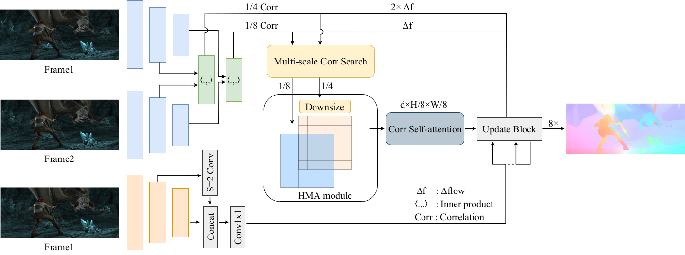

# HMAFlow: Learning More Accurate Optical Flow via Hierarchical Motion Field Alignment
PyTorch implementation for paper Hierarchical Motion Field Alignment for Robust Optical Flow Estimation

Dianbo Ma <sup>1</sup>,
Kousuke Imamura <sup>1</sup>,
Ziyan Gao <sup>2</sup>,
Xiangjie Wang <sup>3</sup>,
Satoshi Yamane <sup>1</sup>
<br>
<sup>1</sup>Kanazawa University,  <sup>2</sup>JAIST,  <sup>3</sup>Jilin University



## Installation
The code is tested with `python 3.9` and `CUDA 12.0.1`. We use Docker containers to deploy all experiments. 

First, create the container.
```
docker run -it --net=host --ipc=host --privileged -v /tmp/.X11-unix:/tmp/.X11-unix -e DISPLAY=unix$DISPLAY -e GDK_SCALE -e GDK_DPI_SCALE -v /DataTwo/hmaflow_master:/workspace/hmaflow_master --gpus all --name hmaflow_repro nvidia/cuda:12.0.1-cudnn8-devel-ubuntu22.04 /bin/bash
Ctrl + D
docker start -ai hmaflow-repro
cd workspace/hmaflow-master
```
Install PyTorch and various packages inside the container.
```
apt update
apt upgrade -y
apt install -y python3-pip
pip3 install torch torchvision torchaudio --index-url https://download.pytorch.org/whl/cu118
apt install python3
pip3 install scipy
apt install -y python3-opencv
pip3 install matplotlib
pip3 install configargparse
pip3 install tensorboard
apt install libcanberra-gtk-module libcanberra-gtk3-module -y
```

## Dataset preparation
Download and prepare the required datasets. The file structure of the datasets is as follows.
```
* [FlyingChairs](https://lmb.informatik.uni-freiburg.de/resources/datasets/FlyingChairs.en.html#flyingchairs)
* [FlyingThings3D](https://lmb.informatik.uni-freiburg.de/resources/datasets/SceneFlowDatasets.en.html)
* [Sintel](http://sintel.is.tue.mpg.de/)
* [KITTI](http://www.cvlibs.net/datasets/kitti/eval_scene_flow.php?benchmark=flow)
* [HD1K](http://hci-benchmark.iwr.uni-heidelberg.de/) (optional)
```


